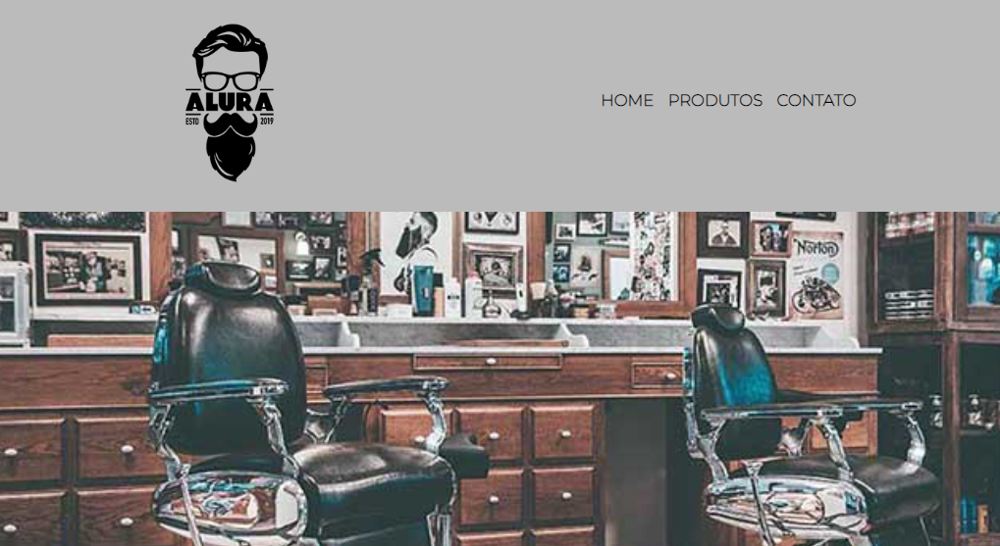

# Projeto Barbearia Alura

Projeto para apresentar um site de uma barbearia.

| :placard: Vitrine.Dev |     |
| -------------  | --- |
| :sparkles: Nome        | **Projeto Barbearia Alura**
| :label: Tecnologias | HTML5, CSS3
| :rocket: URL         | https://thamyresmya.github.io/Barbearia-Alura/
| :fire: Desafio     | Criar um pagina na web. 

<!-- Inserir imagem com a #vitrinedev ao final do link -->

## Detalhes do projeto

Projeto realizado no curso de HTML5 e CSS3, crie uma página da Web.

